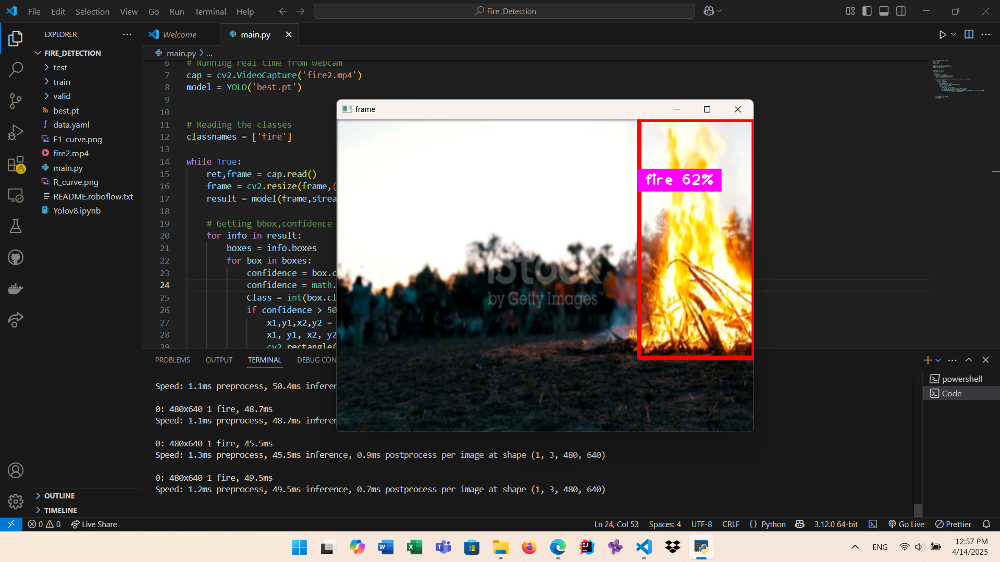

# Fire Detection Using YOLO

This project implements a real-time fire detection system using YOLOv8 object detection model.

## Overview

The system can detect fire in real-time video streams or video files using a custom-trained YOLO model.

## Requirements

- Python 3.8+
- PyTorch
- Ultralytics
- OpenCV
- cvzone

## Installation

```bash
pip install ultralytics
pip install cvzone
pip install opencv-python
pip install torch torchvision torchaudio
```

## Usage

1. Place your trained model `best.pt` in the project directory
2. Place your test video `fire2.mp4` in the project directory
3. Run `main.py`

## Results

Below is an example of the fire detection system in action:



## Features

- Real-time fire detection
- Confidence score display
- Bounding box visualization
- Support for video file input
- Resizable output (640x480)


